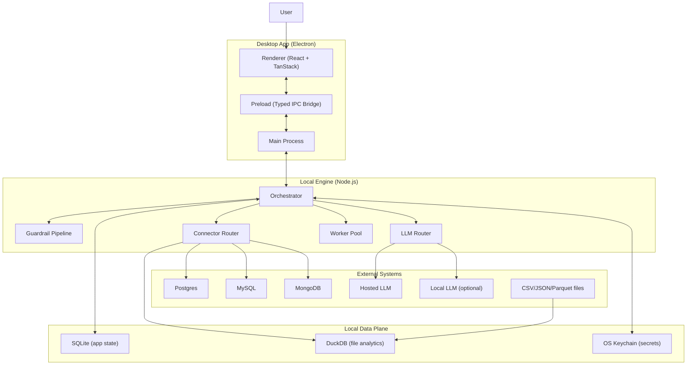
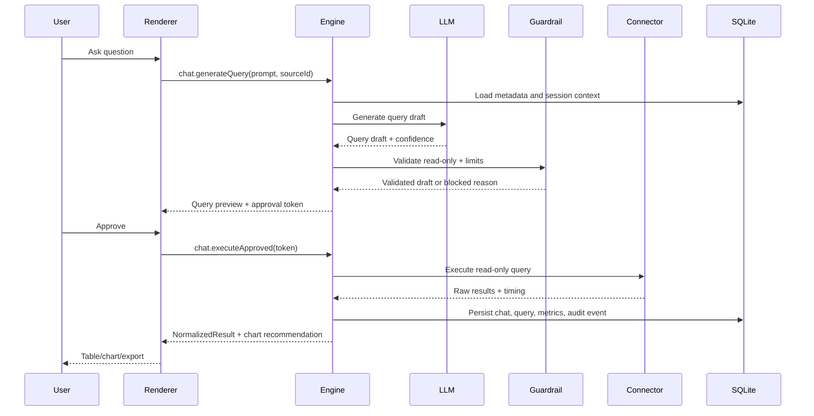

# PolyStoreIQ Architecture Guide (Desktop MVP)

## 1. Purpose

This guide defines the production architecture baseline for the desktop MVP.

Priority order:
1. Time to market.
2. Runtime performance.
3. Connector breadth.

This document is the implementation reference for engineering decisions and sprint execution.

## 2. Locked Decisions

1. Runtime and language:
- Electron desktop app.
- JavaScript/TypeScript across renderer, main process, preload, and engine.

2. App architecture:
- Renderer UI (React + TanStack).
- Electron main process.
- Preload bridge with typed IPC.
- Local Node engine process for orchestration and connector execution.

3. Data stores:
- SQLite (`better-sqlite3`) for app state.
- DuckDB for file analytics only (CSV/JSON/Parquet ingestion and query execution).

4. LLM strategy:
- Provider abstraction.
- Hosted model adapter as default.
- Optional local model adapter.

5. MVP connector scope:
- PostgreSQL, MySQL, MongoDB, CSV/JSON/Parquet.
- Deferred: Neo4j, pgvector, Qdrant.

6. Product scope:
- Single-user local workspace for MVP.
- Read-only query execution only.

7. Platform scope:
- macOS-first release target for MVP.

## 3. Why This Architecture

1. Faster delivery:
- One language and shared types reduce integration overhead.
- Local-first design removes dependency on a full cloud backend for MVP.

2. Better desktop performance:
- Heavy work runs in engine/workers, not in renderer.
- SQLite gives fast local transactional storage.
- DuckDB gives fast analytical execution for file datasets.

3. Safer execution:
- Strict IPC boundaries and schema validation.
- Deterministic guardrails before connector execution.
- Approval token required before query run.

## 4. System Architecture (Whole View)



## 5. Query Lifecycle



## 6. Component Responsibilities

1. Renderer (`apps/renderer`)
- Chat UI, source onboarding, schema explorer, table/chart rendering, export actions.
- Uses TanStack Router, Query, and Table.
- Never accesses connectors or secrets directly.

2. Main process (`apps/desktop`)
- Window lifecycle, update hooks, engine bootstrap.
- Owns secure IPC channel registration.

3. Preload bridge (`apps/desktop/preload`)
- Exposes minimal typed IPC APIs.
- Validates request and response payloads.

4. Engine (`packages/engine`)
- Prompt building, guardrails, connector routing, execution orchestration.
- Session/audit/telemetry persistence.
- Uses worker pool for heavy parsing and normalization.

5. Connectors (`packages/connectors`)
- `postgres`, `mysql`, `mongodb`, and `files-duckdb` adapters.
- Shared interface and typed error model.

6. Shared contracts (`packages/shared-types`)
- IPC schemas, connector contracts, result schemas, and error payloads.

## 7. Data Storage Strategy

1. SQLite is the source of truth for app state:
- Profiles and settings.
- Data sources and status.
- Chat sessions and messages.
- Query history.
- Audit events.
- Telemetry summaries.

2. DuckDB is analytics engine for file data only:
- Ingestion and schema inference for CSV/JSON/Parquet.
- Read-only query execution.
- Result shaping before normalization.

3. Secrets:
- Stored in OS keychain.
- SQLite stores key references only, never plaintext credentials.

## 8. Public Interfaces and Types

1. Connector interface:

```ts
interface Connector {
  testConnection(input: SourceConfig): Promise<ConnectionStatus>;
  fetchMetadata(sourceId: string): Promise<MetadataSnapshot>;
  executeReadOnly(req: ExecutionRequest): Promise<ExecutionResult>;
}
```

2. LLM provider interface:

```ts
interface LLMProvider {
  generate(req: GenerationRequest): Promise<GenerationResult>;
  health(): Promise<ProviderHealth>;
}
```

3. IPC contracts:
- `source.create`
- `source.list`
- `source.test`
- `source.disable`
- `chat.generateQuery`
- `chat.executeApproved`
- `metadata.get`
- `result.get`
- `audit.list`

4. Core shared types:
- `QueryDraft`
- `ApprovalToken`
- `NormalizedResult`
- `AuditEvent`
- `TypedError`

## 9. Security Model

1. Renderer isolation:
- `contextIsolation: true`
- `nodeIntegration: false`
- No direct filesystem or connector access from renderer.

2. Guardrails:
- Read-only enforcement for all connectors.
- Block write or destructive statements and risky patterns.
- Enforce max row limits and execution timeouts.

3. Approval:
- Explicit user approval required before execution.
- Approval tokens are short-lived and single-use.

4. Secrets and logs:
- No plaintext secrets in DB or logs.
- Sensitive fields redacted in telemetry and error payloads.

## 10. Performance Model

1. Keep renderer thin:
- Heavy compute runs in engine and workers.
- Table virtualization and chart dataset limits are mandatory.

2. Latency budgets:
- First response p95 under 5 seconds for moderate queries.
- Chart render p95 under 1.5 seconds for up to 10k points.

3. Performance controls:
- Metadata TTL cache.
- Query timeout and cancellation.
- Row and sampling limits.
- Backpressure queue for concurrent requests.

4. Metrics:
- Track p50/p95 for generate, validate, execute, normalize, and render stages.

## 11. Packaging and Release

1. Build and distribution:
- Electron Builder for macOS artifacts.
- Signed and notarized builds for beta.
- Auto-update channel with rollback support.

2. Release policy:
- No beta release with open P0/P1 security defects.
- Regression suite and UAT sign-off required.

## 12. Deferred Scope (Post-MVP)

1. Cloud collaborative workspaces and shared sessions.
2. Enterprise SSO/SAML/SCIM.
3. Advanced connectors: Neo4j, pgvector, Qdrant.
4. On-prem and multi-tenant managed control plane.
5. Plugin marketplace.

## 13. Risks and Mitigations

1. LLM invalid query generation:
- Mitigation: schema grounding, deterministic validators, mandatory approval gate.

2. Connector edge-case drift:
- Mitigation: contract tests and capability matrix per connector.

3. Large file performance issues:
- Mitigation: DuckDB execution path, sampling limits, export limits.

4. Desktop security regressions:
- Mitigation: strict IPC surface, security tests, dependency audits.

## 14. Architecture Readiness Scenarios

1. Core flow:
- Add source, ask question, preview query, approve, execute, view chart.

2. Safety flow:
- Write-intent prompt is blocked before execution.

3. Storage flow:
- No plaintext credentials in SQLite.
- Chat and audit events persist reliably.

4. File analytics flow:
- CSV/JSON/Parquet can be ingested and queried via DuckDB connector.

5. Performance flow:
- Query and render SLA metrics are visible and within target thresholds.

6. Resilience flow:
- Connector timeout or failure yields typed errors while UI remains responsive.
